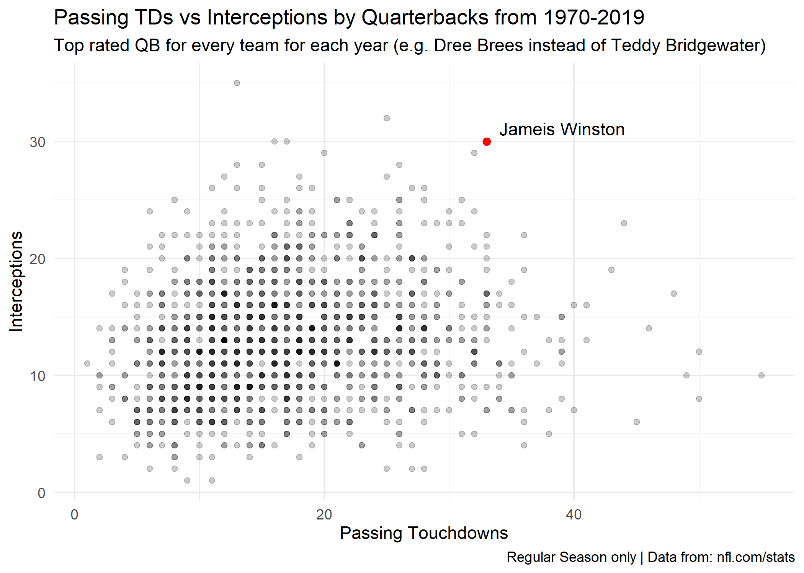
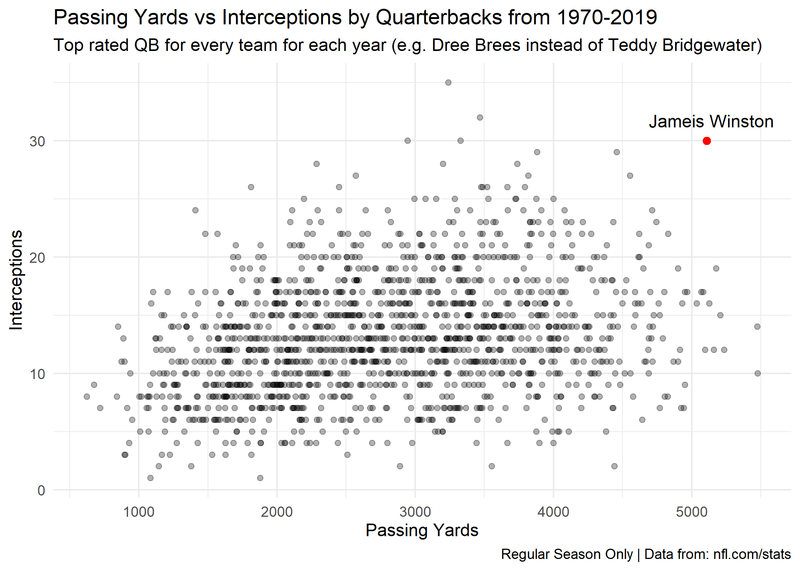

Jameis Winston - 2019 Season
================
12/30/2019

# Introduction

During the 2019 NFL Season, Jameis Winston, quaterback for the Tampa Bay
Buccaneers, set multiple new records. Over the course of 16 games, he
achieved these record setting statistics:

  - 5,109 Passing Yards  
  - 33 Passing Touchdowns  
  - 30 Interceptions

As the first player in NFL history to achieve 30+ interceptions and
5,000+ passing yards/30+ passing touchdowns, I began to wonder just how
unique this season was. Thus, I decided to scrape data from the [nfl
website](http://www.nfl.com/stats/categorystats?tabSeq=1&statisticPositionCategory=QUARTERBACK&qualified=true&season=2019&seasonType=REG)
to compare him to past quaterbacks.

Here, I scraped data from 1970-2019. I chose 1970 since it was the first
year of the NFL/AFL merger, resulting in a standardization of rules. I
also took only the top quarterback for every team for each year. As
every season has injuries/substitutions, I didn’t want to overload the
visualizations with 3-4x the number of players with minimal amounts of
playing time. The top quarterback for each team was selected based on
the ranking determined on the nfl website.

The scraped data can be found in the ‘Data’ folder. When this code
breaks in the future (i.e. when the 2020 season begins), the scraping
code can be easily adjusted.

# Passing Yards vs Interceptions

# Passing Touchdowns vs Interceptions

From these figures, we can certainly see that it was a unique year.
Whether or not it is sufficient to declare him an outlier is down to
personal judgement, but we can certainly say that he is an exciting
player to watch. Here’s to an equally exciting 2020 season.
